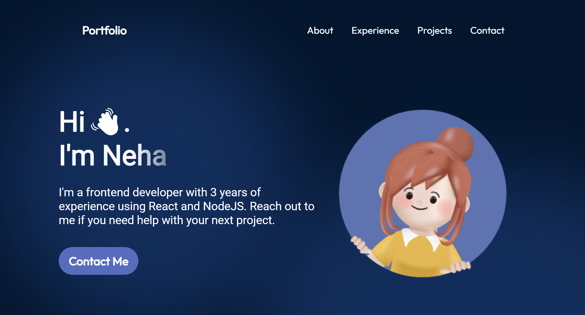

# Example Portfolio (React + Vite Project)

This project is my first experience working with React and Vite, created as a part of a tutorial to explore modern web development workflows. It showcases the fundamentals of building a responsive and interactive web application using React for the frontend and Vite for efficient bundling and development. This project helped me understand the basics of React components, state management, and the fast build times offered by Vite. It's a milestone in my journey as a frontend developer.

## Features

- This project was created by following a React and Vite tutorial to learn the basics of building modern, responsive web applications.
- It covers essential concepts, including
  - Setting up a React project with Vite.
  - Structuring components.
  - Implementing interactivity.
  - Styling the interface effectively.
  - The tutorial provided hands-on experience with key React features, such as:
  - Props
  - State management
  - Conditional rendering
- Vite's fast development environment was leveraged throughout the project.
- This project serves as a foundational step in mastering React and building dynamic web applications.
## Technologies Used

- **Frontend:** React, Vite, Html, CSS, Javascript


## Installation

1. Clone the repository to your local machine:
```bash
git clone https://github.com/nipun-munasinghe/example-react-portfolio
```
2. Navigate to the project directory:
```bash
cd example-react-portfolio
```
3. Install and run
```bash
npm install
npm run dev
```

## Screenshots




## Learning Experience

Through this project, I gained valuable hands-on experience in building responsive websites, implementing advanced CSS styling techniques, and understanding how React works. By following the tutorial, I enhanced my skills in creating dynamic user interfaces and learned how to efficiently structure and manage a React project. This project provided me with a solid foundation in React and modern web development practices, helping me grow as a developer.


## Acknowledgements

Special thanks to [Code Complete](https://youtu.be/YQCDUJ6hhNY?si=Wsewk5LXxZCesiX3) for the amazing tutorial.


## Contributing

Contributions are welcome! If you want to improve this website, feel free to fork the repository and submit a pull request.


## Contact

- Developer: Nipun Munasinghe
- LinkedIn: [Nipun Lakmal](https://www.linkedin.com/in/nipun-lakmal-b5b3652bb?utm_source=share&utm_campaign=share_via&utm_content=profile&utm_medium=ios_app)
- Email: [nipunlakmal884@gmail.com](mailto:nipunlakmal884@gmail.com)
- GitHub: [nipun-munasinghe](https://github.com/nipun-munasinghe)
